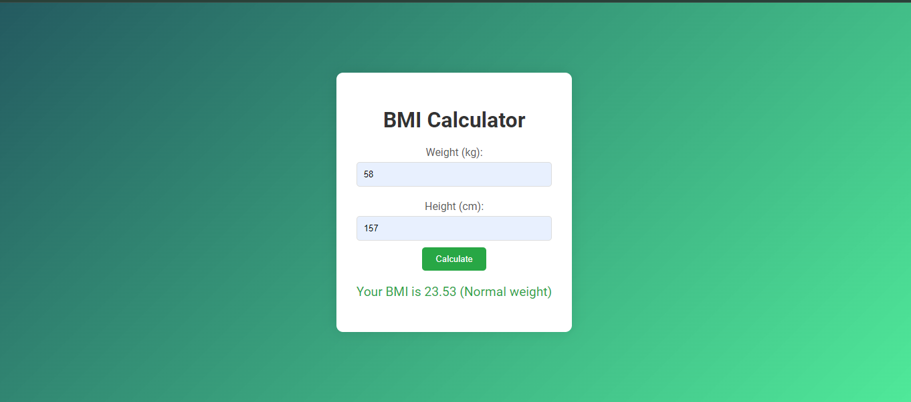

# Task 2: BMI Calculator

## Description

The BMI Calculator is a web application that allows users to calculate their Body Mass Index (BMI) based on their weight and height. This project introduces students to handling forms, user input, and performing mathematical calculations with JavaScript. Additionally, it emphasizes the use of CSS for styling and enhancing the user interface.

## Screenshots of the Project



## Objectives
- To practice creating and structuring an HTML document.
- To apply CSS for styling the web page.
- To use JavaScript for manipulating the DOM and performing calculations.
- To understand how to work with forms and user input in JavaScript.

## Technologies Used
- HTML
- CSS
- JavaScript

## Getting Started
Follow these instructions to set up the project on your local machine.

### Prerequisites
- A code editor (e.g., Visual Studio Code)
- A web browser (e.g., Google Chrome)

### Installation

Fork this repository by clicking on the fork button on the top of this page. This will create a copy of this repository in your account. Then follow these steps:

1. Clone the repository to your local machine:
   ```sh
   git clone https://github.com/yourusername/javascript-projects.git
   ```
2. Navigate to the project directory:
   ```sh
   cd bmi-calculator
   ```

## Project Structure

The project files and directories are organized as follows:

```
bmi-calculator/
│
├── index.html       # The main HTML file
├── style.css        # The CSS file for styling
└── src.js           # The JavaScript file for functionality
```

## Usage

1. Open `index.html` in your web browser.
2. Enter your weight and height in the provided input fields.
3. Click the "Calculate BMI" button to see your BMI displayed.

## Code Explanation

### HTML
- The HTML file (`index.html`) contains the basic structure of the web page, including the form for inputting weight and height, and the section for displaying the calculated BMI.

### CSS
- The CSS file (`style.css`) styles the web page, including the container, form, and result display.

### JavaScript
- The JavaScript file (`src.js`) contains the logic for calculating the BMI based on the user's input and updating the DOM to display the result.

## Detailed Steps

### HTML (index.html)
- Create a basic HTML structure with a `<!DOCTYPE html>` declaration.
- Add a `meta` tag for character set and viewport settings.
- Include a `title` tag to set the page title.
- Link the CSS file using the `link` tag.
- Create a `div` container for the main content.
- Inside the container, add an `h1` tag for the title.
- Create a form with labels and inputs for weight and height, and a button to calculate the BMI.
- Add a `div` to display the result.

### CSS (style.css)
- Style the container to center the content and set a max-width.
- Style the form elements (labels, inputs, button) for a clean appearance.
- Style the result display to make it stand out.

### JavaScript (src.js)
- Select the necessary DOM elements (inputs, button, result container).
- Add an event listener to the button to trigger the BMI calculation.
- Define a function to calculate the BMI based on the input weight and height.
- Update the result container with the calculated BMI.

## Submitting the Project

After setting up the project on your local machine and writing the necessary code, follow these steps to submit your project:

1. Create a new folder/directory on your local machine in the `javascript-projects/bmi-calculator` directory. Name it `your-name`.

> For example, if you are using Visual Studio Code, you can create a new folder by clicking on the `New Folder` icon in the `Explorer` sidebar and naming it `bmi-calculator`.
>
> Your folder structure should look like this:
>
> ```
> javascript-projects/
> │
> ├── bmi-calculator/
> │   ├── your-name/
> │   │   ├── index.html
> │   │   ├── style.css
> │   │   └── src.js
> │
> └── ...
> ```

2. Write the necessary code for the project by following the instructions provided in the project description.
3. Once you have completed the project, push your code to the remote repository on GitHub.
   
   3.1 Create a new branch:
   ```sh
    git checkout -b your-branch-name
    ```

    3.2 Stage your changes:
    ```sh
    git add .
    ```

    3.3 Commit the changes:
    ```sh
    git commit -m "Add project files"
    ```

    3.4 Push the changes to the remote repository:
    ```sh
    git push origin your-branch-name
    ```
4. Create a pull request on the original repository.
5. Add a title and description to your pull request.
6. Submit the pull request.
7. Congratulations! You have successfully submitted your project.

## Resources

- [W3Schools HTML Tutorial](https://www.w3schools.com/html/)
- [W3Schools CSS Tutorial](https://www.w3schools.com/css/)
- [W3Schools JavaScript Tutorial](https://www.w3schools.com/js/)

## License

This project is licensed under the MIT License - see the [LICENSE](LICENSE) file for details.